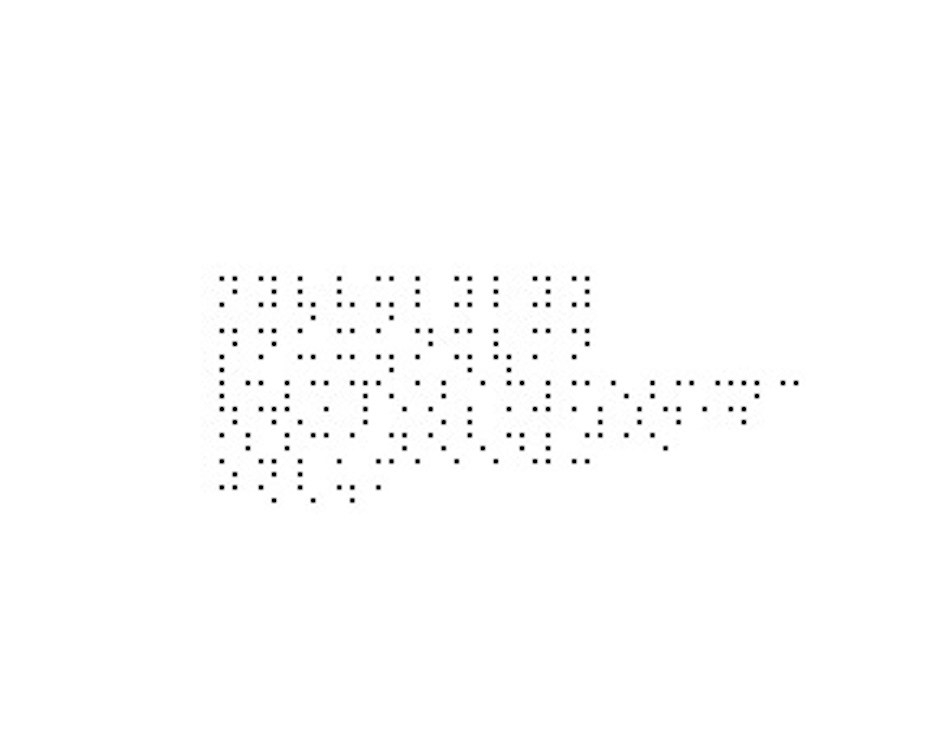

# a1: Image Processing and Recognition Basics
## Developers: 
karachar(Karan Milind Acharya), marcskin(Marcus A Skinner), pchakila(Pranav Vijay Chakilam)

# Introduction
The goal of the grader is to inject the correct answers on the document, read the student answers, extract the correct answers, then grade the paper. For this to happen, we need some way to identify key points of the document. We started with exploring a couple different methods--including, Hough Transform and corner detection algorithms. But, complex methods like these are unreliable and even one mistake can cause significant malfunctions in the grader. Futhermore, we did not find them necessary since the document has a basic structure that makes the lines and corners evident, and we decided that we could leverage this structure to find the key points.

Since the document has a set structure, the relationship between anything in the document remains the same to everything else. So, if we can find one point on the document, figure out the scale and rotation, then every other point is just a linear transformation from the initial point. This idea fueled the code, starting with utils.py, which lays the foundation for <code>inject.py</code>, <code>extract.py</code>, and <code>grade.py</code>.

# utils.py
The main objective of <code>utils.py</code> is to identify the bottom, right corner of E on question 58 and to partition the document into 29 rows. One row represents a set of three questions on the same line. For example, row 1 would contain questions 1, 30, and 59. utils.py has three functions--<code>find_point</code>, <code>find_rows</code>, and <code>find_whitespace</code>. These three function will be used throughout the rest of the code.

### find_point
<code>find_point</code> returns the rightmost pixel of the first non-white row of pixels, starting at some y value given by the user. For example, if the user sets <code>y = height of the document - 1</code>, then the function will return the bottom right corner of the E on question 58. 

### find_whitespace
<code>find_whitespace</code> is kind of the opposite of <code>find_point</code>. It finds the first all white row starting from a given y. It is a helper function for find_rows.

### find_rows
<code>find_rows</code> partitions the document into 29 rows. It returns a list of where the bottom of the row starts. It does this by finding the bottom, rightmost pixel, calling find_whitespace to find when the row ends, the calling find_point for the next row, starting at the y value after the previous row. It does this for all 29 rows. In the beginning, we only found the width of the first row then used this width for the rest of the rows. But we found that if the program slightly miscalculated the initial pixel, then the error would cascade through the rest of the document, causing major issues. For example, if the width of the row was calculated to be 46 but it was actually 47, then the next row would be off by 2, then the next row by 3, etc. The last row would often be several pixels off. By recalculating for each row, we make the system robust the slight miscalculations. 

Note: We also tried hard-coding the width of a row. But, if the scale was different at all, then we would run into issues. By calculating the width of the row, we make our code robust to changes in scale.

# Injection & Extraction
## Idea
- The approach, in simple words is: To convert the list of correct answers for the given question set into an encrypted format (human unreadable) effectively not revealing the correct answers to the student.
- As mentioned in the assignment description, we started with reading about how to implement a version of barcode/QR code in Python. We found existing libraries for the same; and hence we started looking at how to go about implementing the same from scratch. We realised an interesting thing: These barcodes/QR codes are generally used when one places a reader device just above them. In this assignment, we'll be reading the whole image which is nothing but a set of numbers and the idea is to find the location of these ciphers. Thus, we abandoned the idea of going ahead with these specialised codes.
- Next, we stumbled upon the concept of steganography - the idea of encoding information in an image in such a way that only people who know what to look for can decipher it. It stares you right in the eye, but if one doesn't know what to look for, he cannot understand it.

## Working
- We decided to convert our list of ground truth answers into a format which cannot be read by humans who don't know what they're looking for. Potential encoding options for alphabets: Morse code, Binary code, Braille alphabet. We chose the latter and found the conversions at [1].
- Each alphabet is represented in it's Braille counterpart with 5 pixel distance between each atomic component of the Braille alphabet. Each Braille component is represented by a 2x2 grid of black pixels. Each letter for the same question is seperated by 10 pixels; each question's answer by 5 pixels. Initially, the gaps were bigger during testing for us, mortal humans to figure out whether the output was correct. Later, were they reduced to look like a small QR code:

- In the initial testing stages, we chose a fixed coordinate position at which to start injecting the list after converting to Braille.
- Similarly, `extract.py` used most of the same aforementioned logic from `inject.py` with `putpixel` replaced by `getpixel`. We tried testing extraction using the same Pillow Image instance on which injection was performed. It worked well!
- But then, after the `injected.jpg` was saved and loaded into `extract.py`, it failed! The reason: In `extract.py`, we were just checking at the particular location whether `getpixel(x, y) == 0`. This was wrong. After saving the color was being affected and some small noise was being inserted around each pixel. This was corrected using a threshold of 100, instead. 
- With the above correction step, extraction worked very well - on all test images.

## Making it smarter
- The only problem with the above working was: The pixel positions at which both injection and extraction was pre-determined - by us! That wasn't great.
- Solution: In both `inject.py` and `extract.py`, find the correct starting position! The approaches mentioned above in the **utils.py** section were developed and used. This, smart heuristic approach using several thresholds turned out to be very good!
- Given any image on which injection had already been performed, our `extract.py` correctly extracts the code, converts it back to English alphabets and generates the `output.txt`.

# Grading

## Approach

- In order to detect the answers filled by the student for each question, we first detect the regions (the option boxes, the question number, and any writing in front of the question if any). To achieve this we first identify the rows in the image and then start examining each row. In each row we identify the starting point and ending point of the subregions mentioned above (see below image for reference) using a sliding window with a width equal to 1 and a height that is equal to the height of the row. A list of heuristic thresholds such as <code>min_box_width</code>, <code>min_inter_box_gap</code> to perfrom this scanning. The sum of the pixel values in this window are summed and compared to a threshold to check if there is any writing in that space. To cluster the subregions into groups corresponding to each question we use a threshold called <code>max_inter_box_gap</code>. 

- Next, we examine each question's subregions and look at the individual answer boxes. We sum their pixel values and check if it is below a threshold called <code>filled_threshold</code> to determine whether they were filled by the student or not. All the thresholds are determined experimentally. Finally, for each question we check if there is any substantial writing in front of the question and assign an 'x' as well to the question's detected answer if there is a region.

- Finally, the detected answers are written to the output txt file.
All this is done using the <code>grade</code> function in <code>grade.py</code>.

## Problems Encountered

- Although the code was working perfectly with most of the images, it was encountering problems with detecting writing in front of the first 9 questions.
We identify that this is because of the question numbers which are single digits and occupy less space causing the writing in front of the question and the question number to be grouped into a single sub region. This problem is solved by setting a separate minimum inter-box gap and minimum box width thresholds for the questions in this region.

## Testing and Results

- We create ground truth txt files for all the given test images (present in the test-images folder) and test our code on them. We obtain an accuracy of **100%**. The code used to test these images, calculate the accuracy and display the wrong questions and their actual answers, is present in the <code>grade.py</code> file in a function called <code>test</code>.

# Observations & Caveats
- Both `inject.py` and `extract.py` work with a **100% accuracy** when compared with their corresponding ground truth answers. (The ground truth answers that were injected were compared with the outputs of extraction for that file.)
- The program works best on the perfectly pre-processed images which are in the given test set - all are 1700x2200 image, centered and aligned correctly. 
- We tried to print several outputs of `inject.py` and then again scan it to provide input to `extract.py`. If we could scale, align, center and resize it to match the ones in the test set, our program would have worked perfectly. We did not spend much time in this pre-processing stage to get printed images scanned perfectly. Other approaches can be explored to handle such variation as well. As our programs were working perfectly on the given test images, we did not explore other options.
- The program assumes there will be no rotation in an image. If there's any rotation, then the lines will be off. We understand that this might be an issue, and if we had more time, we would try to make our program robust to changes in rotation.

# Contribution of the authors
- karachar: Research and develop `inject.py` and `extract.py`.
- marcskin: Develop `utils.py` which is the starting brains behind both `grade.py`, `inject.py` and `extract.py`. 
- pchakila: Develop `grade.py`.

# References:
1. https://www.pharmabraille.com/pharmaceutical-braille/the-braille-alphabet/ 
